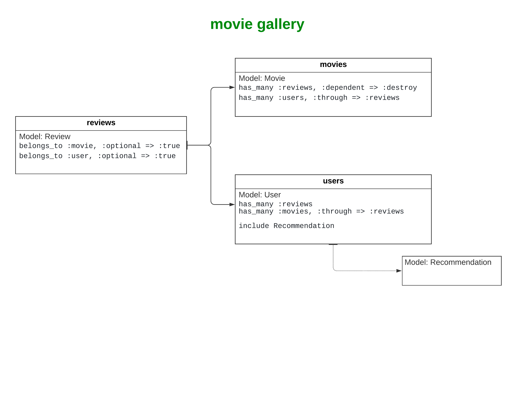

# Movie Gallery
This application is a movie review with recommendations.

## Try it on
You can access and use this application at: [Project 1 - Movies Gallery](https://projectone-moviesgallery.herokuapp.com).

## Project Description
In this application, after making a sign-in / sign-up, you will be able to make a review of a movie with a rate and a comment. There is a simple recommendation system that will recommender movies you didn't do a review based on how many movies you have in common with another user.

## Usage
* The user can do a review just after making sign-in / sign-up;
* This application uses the IMDB API to search for movies;
* Every movie has been chosen (clicked) for the first time, include a new item in the database;
* The recommendation system calculates the number of reviewed movies the user has in common with another user; the more movies the user share with another user, the more weight will be put on their recommendation; the weight is calculated by dividing the total number of shared movies by the total number of all movies the other user reviewed.

## Tech Stack
* Ruby
* Ruby on Rails
* CSS

## Association Models Diagram

## Images

